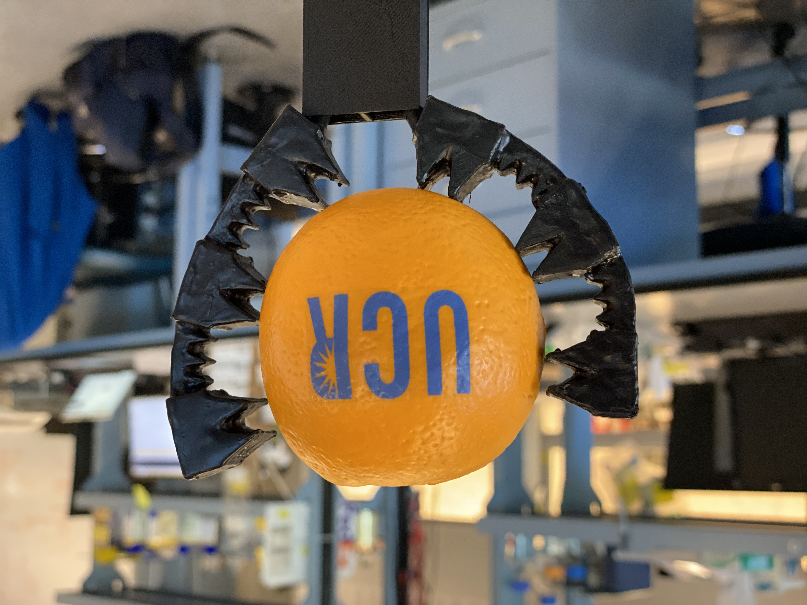

# Soft robotic fingers

SolidWorks files containing the design of a vacuum-powered 3D-printable soft robotic finger.  Instructions on printing and using the finger are available in [this paper](https://journals.plos.org/plosone/article?id=10.1371/journal.pone.0254524).
